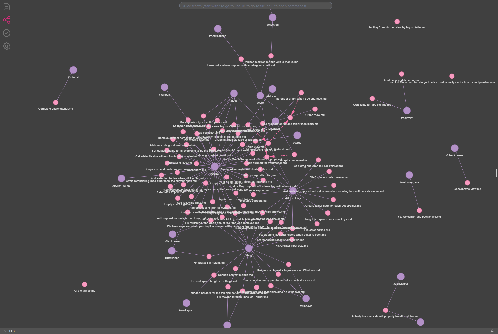

Важной частью организации знаний в #ordo_pink является система связывания файлов. Файлы можно связывать между собой,
используя ссылки в формате Wikilink. Кроме того, файлы находятся в папках, что позволяет привычным способом работать над
группировкой и организацией. И, напоследок, файлы можно группировать по тегам. Каждый подход имеет свои преимущества
и недостатки и места применения, а главное - их можно миксовать. Да и вообще, попробуйте положить файл не в папку, это
должно быть интересно)

## Оглавление

1. [Про маркдаун](/blog/markdown-basics)
2. [Как связывать мысли](/blog/linking-thinking)
3. [Про визуализацию заметок в Ordo](/blog/using-ordo-components)

## Как организовать

### Организация в папках

Как в старые добрые, создаём папку `Игры` и кладем туда игры. Создаём папку `Фильмы`... Ну, вы поняли. Создаём папку
`Рассортировать` и раз в полгода всё оттуда удаляем. В общем, что я вам рассказываю, вы и так всё прекрасно знаете. Тем не
менее, папки - это интуитивно понятный и удобный способ организации.

Во-первых, на уровне папок можно разделить проекты. Можно создать общую папку со всеми проектами, но в приложении #ordo_pink
открывать каждую папку с проектом в отдельности. В случае же, когда нужно посмотреть на общую картину, можно открыть в приложении
папку уровнем выше, и посмотреть на вещи стратегически. Например, если нужно собрать все чекбоксы в одном месте, или собрать
супер-глобальную канбан-доску.

Во-вторых, папки обладают уникальностью. Дело в том, что файл физически может находиться в одной, и только в одной папке. Если один
файл находится в двух папках, то это либо не файл, либо это все таки не один файл. Это позволяет присвоить файлам уникальное свойство, а потом
использовать его для группировки. В разделе [Про визуализацию заметок в Ordo](/blog/using-ordo-components) мы посмотрим на Kanban-компонент, который полагается на папки
в качестве колонок, и на файлы - в качестве карточек. В новых обновлениях #ordo_pink папки будут использоваться и для других вариантов
группировки.

В-третьих, папки позволяют легко двигать и/или удалять группы файлов. Если что-то больше не релевантно - всегда можно легко, быстро и задорно
затолкать это в корзину.

**Итого**: говоря умными словами, отношение `папка -> файл` предпологает связь One-to-Many, где на одну папку может приходиться много
файлов, а у каждого файла родительская папка одна и только одна.

### Организация в тегах

Теги можно разместить в любом месте в тексте, #ordo_pink автоматически их подтянет, и начнет использовать для своих целей. Сами по себе теги
не хранятся где-то в конкретном месте - их виртуальная натура проявляется по мере наполнения проекта файлами, в которых вы эти самые теги
используете. Если возвращаться к умным словам, отношение `тег -> файл` формирует связь Many-to-Many, где многие теги могут использоваться
в многих файлах, и каждый тег может использоваться в разных файлах многократно.

### Организация в ссылках

Это самая интересная часть. Файлы можно связывать между собой по тому же самому принципу Many-to-Many в паре `файл -> файл`. С помощью
этого механизма строится связность документов, позволяющая переходить от одного отрывка информации к другому. На этом принципе построен
Zettelkasten - метод, позволяющий формулировать свои мысли, знания и наблюдения не в виде отдельных заметок, а в ссылочном формате, наподобие
Википедии.

## К чему всё это

Наиболее удобный формат организации своих заметок каждый выбирает под себя. Кто-то предпочитает вкладывать категории (в категории), кто-то
размахивает хештегами, фильтруя по ним заметки, а кто-то строит лабиринт знаний по канонам Зонке Аренса - #ordo_pink не ограничивает вас в
том, что больше подходит. Но настоятельно рекомендует попробовать разные подходы и их комбинации. Возможно, получится найти для себя
то самое, которое решит все проблемы и приучит вас, наконец, с удовольствием писать каждый день.

[Назад](/blog/markdown-basics) | [Далее](/blog/using-ordo-components)
