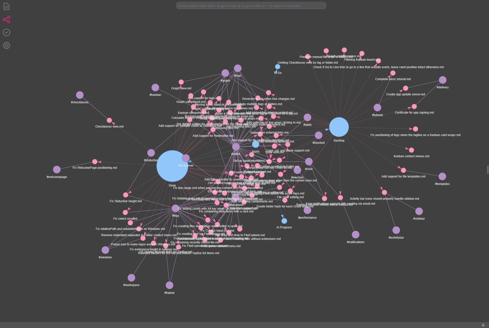
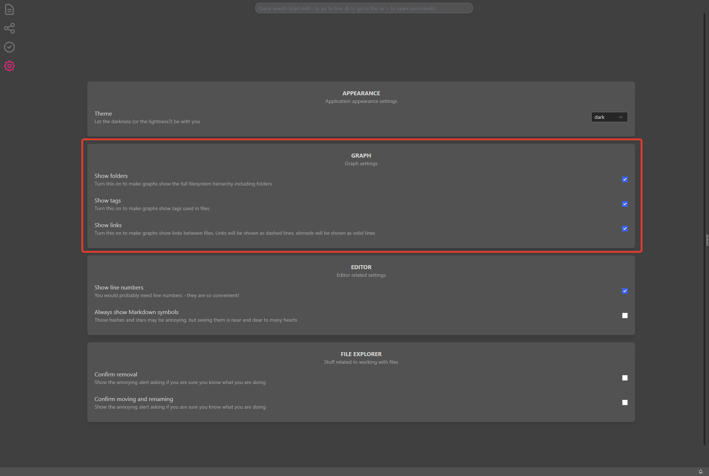
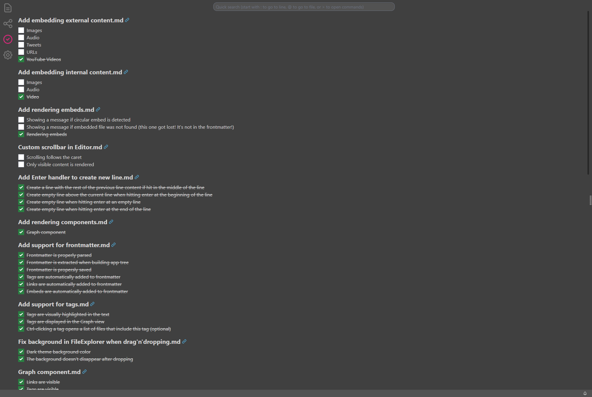
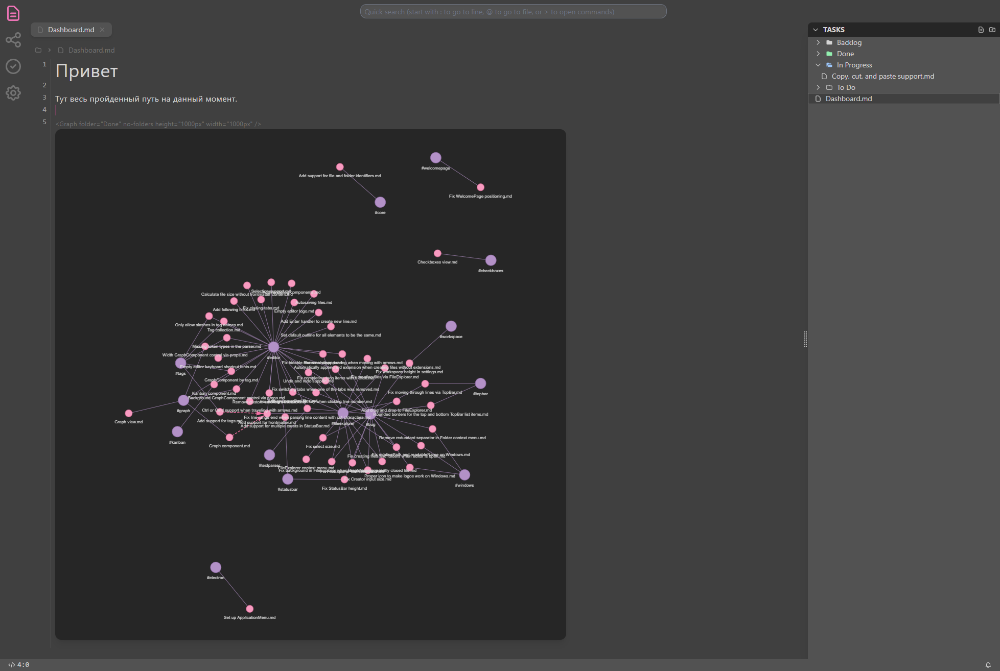
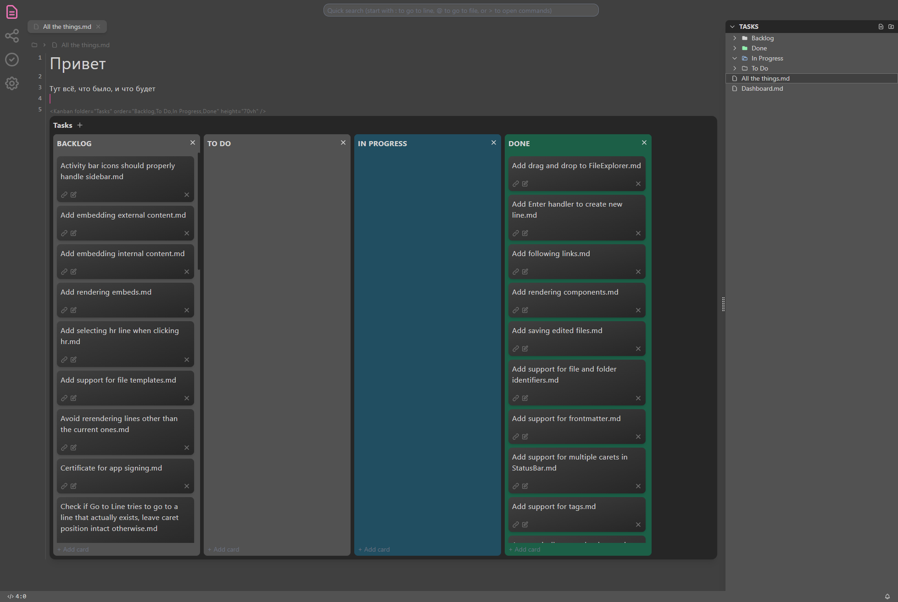

Писать заметки - это дело благородное, но само по себе, к сожалению, не всегда полезное. Важно в них еще и не теряться.

## Оглавление

1. [Про маркдаун](/ru/markdown-basics)
2. [Как связывать мысли](/ru/linking-thinking)
3. [Про визуализацию заметок в Ordo](/ru/using-ordo-components)

Для этого в #ordo_pink есть визуализация заметок. На сегодняшний день это два глобальных и два локальных компонента.

## Глобальные компоненты ORDO

К ним относятся разделы _Checkboxes_ и _Graph_. В них можно попасть кликом в Activity Bar, расположенном справа, либо воспользоваться
комбинациями клавиш - **Ctrl/Cmd + Shift + C** для перехода в _Checkboxes_ и **Ctrl/Cmd + Shift + G** для перехода в _Graph_.

### Graph View

Граф отображает все файлы, находящиеся в проекте. Помимо самих файлов, граф может отображать:



- папки, в которых эти файлы находятся
- теги, используемые в различных файлах
- ссылочные связи между файлами

Отображением каждого вида связей можно управлять через настройки приложения (иконка в Activity Bar справа, или **Ctrl/Cmd + ,**).



### Checkboxes

В этом разделе отображаются все нажатые и отжатые чекбоксы проекта. Отсюда их можно прожимать и разжимать - изменения сохранятся
в том файле, в котором использованный чекбокс находился изначально.



## Локальные компоненты ORDO

Локальные компоненты - это компоненты, которые можно разместить прямо посреди заметки. К таким компонентам относятся _Graph_
и _Kanban_. Каждому локальному компоненту можно задать ширину и высоту. Ширина по умолчанию равна ширине области редактора, а высота -
половине высоты области редактора. Указывать в ширине и высоте можно любые CSS значения, применимые для свойств **height** и **width**.

### Graph



В отличие от глобального графа, отображающего все файлы в проекте, локальный граф отображает содержимое указанной папки. Чтобы создать
граф в заметке, нужно использовать тег компонента:

```markdown
<Graph folder="FOLDERNAME" />
```

Граф требует указания одного обязательного атрибута - названия папки. Например, `Graph folder="Tasks" />`. Помимо обязательного атрибута,
компонент поддерживает следующую конфигурацию:

#### no-links

Скрывает отображение ссылочных связей

#### no-folders

Скрывает отображение папок

#### no-tags

Скрывает отображение тегов

#### no-background

Скрывает отображение затемнённого фона

#### width

> width="500px"

Задаёт ширину компонента

#### height

> height="80vh"

Задаёт высоту компонента

### Kanban



_Kanban_ отображает папки и вложенные в них файлы в виде канбан-доски, где папки выступают в качестве колонок, а файлы - в качестве
карточек. Чтобы создать доску в заметке, нужно использовать тег компонента:

```markdown
<Kanban folder="FOLDERNAME" />
```

Канбан также требует указания одного обязательного атрибута - названия папки. Например, `Kanban folder="Tasks" />`.
Компонент поддерживает следующую конфигурацию с помощью атрибутов:

#### folder

> folder="Tasks"

Использует указанную папку для формирования

#### order

> order="To Do,Doing,Done"

Формирует порядок отображения колонок. Если этот атрибут используется, все неуказанные папки не будут отображены на доске. Названия вложенных папок указываются через запятую, без пробела.

#### properties

> properties="links,todos,tags"

Определяет, какие свойства должны быть указаны на каждой карточке в доске. Поддерживаются **links**, **todos** и **tags**

#### no-background

Скрывает отображение затемнённого фона

#### width

> width="500px"

Задаёт ширину компонента

#### height

> height="80vh"

Задаёт высоту компонента

[Назад](/ru/linking-thinking)
